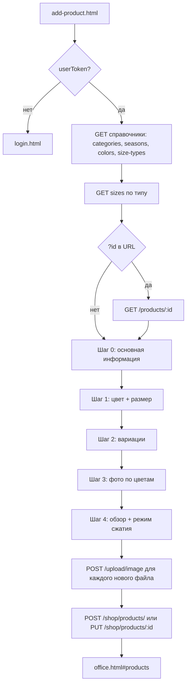

# Добавление товара (Libiss POS): шаги, поля, эндпоинты

Документ описывает **фактическое поведение фронтенда** (`add-product.html` + `src/js/pages/add-product.js`) и связанные **HTTP-эндпоинты** API.

**Базовый URL API:** задаётся в `VITE_API_URL` (см. `src/js/lib/api.js`); по умолчанию `https://api.libiss.com/api/v1`. Все пути ниже — **относительно этого префикса**.

**Авторизация:** для страницы добавления товара в `localStorage` должен быть `userToken`. Иначе редирект на `/login.html?redirect=...`. Для защищённых запросов отправляется заголовок `Authorization: Bearer <userToken>`.

---

## Точки входа в UI

| Действие | Куда ведёт |
|----------|------------|
| Кнопка «Добавить товар» в кабинете | `add-product.html` (см. `office.js`, `data-office-add-product`) |
| Редактирование | `add-product.html?id=<uuid товара>` — подгружается товар через GET (см. ниже) |

После успешного создания/обновления: редирект на `/office.html#products`, черновик в `localStorage` очищается.

---

## Загрузка справочников при открытии страницы

При инициализации вызывается `loadAttributes()`: **четыре параллельных GET без токена** (`token: null` в вызовах):

| Метод | Путь | Назначение |
|-------|------|------------|
| GET | `/categories/` | Дерево категорий для селектора |
| GET | `/seasons/` | Сезоны |
| GET | `/colors/` | Цвета (чекбоксы + hex) |
| GET | `/size-types/` | Типы размеров (одежда, обувь и т.д.) |

После этого:

- По умолчанию выбирается **первый** тип размера из списка и вызывается загрузка размеров.
- GET `/sizes/?size_type_id=<id>` — список размеров для выбранного типа.
- Если типов нет — GET `/sizes/` (все размеры).

**Редактирование:** если в URL есть `id`, дополнительно:

| Метод | Путь | Токен |
|-------|------|--------|
| GET | `/products/:id` | Bearer (в коде путь без префикса `shop`; ответ нормализуется из `product` / `data`) |

Форма заполняется из ответа; вариации и фото восстанавливаются из `variations`, в т.ч. `imageUrlsByColor`.

---

## Мастер: 5 шагов (индексы 0–4)

### Шаг 0 — основные данные товара

**Поля формы (имена полей = ключи в payload где применимо):**

| Поле (name) | HTML / тип | Обязательность | Значения / примечания |
|-------------|------------|----------------|------------------------|
| `name` | текст | да | Название |
| `qrCodeUrl` | текст, readonly | нет | Только сканер камеры (шаг 1) |
| `description` | textarea | нет | Описание |
| `gender` | radio | да | `unisex` \| `male` \| `female` |
| `categoryId` | hidden | да | UUID, выбор через `CategorySelector` |
| `seasonId` | hidden | нет | ID сезона (число в payload парсится как int) |
| `price` | number | да | Базовая цена (используется для расчёта итоговой при скидке) |
| `discount` | number 0–100 | нет | Процент скидки; показывается расчёт «старая → новая» цена |

Валидация шага: стандартная `checkValidity()` по `required` + для категории — сообщение через `data-error-for="categoryId"`.

### Шаг 1 — цвета и размеры

- Чекбоксы цветов из `/colors/` (`value` = id цвета).
- Селектор типа размера → перезагрузка списка размеров.
- Чекбоксы размеров из `/sizes/` (с фильтром по типу).

**Правило:** должен быть выбран **хотя бы один цвет и один размер**. Иначе шаг не проходит (`validateStep`, `currentStep === 1`).

### Шаг 2 — вариации (декартово произведение)

При переходе на шаг вызывается `generateVariations()`: для каждой пары (выбранный цвет × выбранный размер) создаётся строка с полями:

- `stock` (по умолчанию 1 для новых строк),
- `price` (по умолчанию цена с учётом скидки от базовой),
- `qrCodeUrl` (наследуется с шага 0 или своя со сканера),
- `discount`, `originalPrice`.

Пользователь правит остаток, цену, QR по каждой вариации.

**Проверка:** `variationsData.length > 0`.

### Шаг 3 — фото по цветам

- Для **каждого выбранного цвета** — отдельный блок загрузки.
- Источники: галерея или камера (`capture="environment"`).
- **Максимум 5 фото на один цвет** (новые файлы + уже загруженные URL).

Файлы пока только в памяти (`photosData`); на сервер уходят на шаге отправки формы.

### Шаг 4 — проверка и режим загрузки фото

- Выбор **режима загрузки изображений** (радио `uploadPhotoMode`):
  - `compressed` (по умолчанию) — перед POST сжатие в WebP (качество ~0.82, max ширина 3024px), параметр `readyWebp=true` при загрузке.
  - `original` — файл как есть (если не webp, может сжиматься отдельной веткой в `uploadImages`).
- Показ сводки: название, категория, сезон, цена, скидка, по цветам — превью фото и сетка размеров/остатков/цен.

Для превью на этом шаге изображения проходят **локальное сжатие** (`compressImage`) для отображения в обзоре (отдельно от режима отправки).

---

## Черновик (localStorage)

- **Ключ:** `addProductDraft`.
- **Сохранение:** при переходе «Далее» (`saveDraft`) и при изменении вариаций/фото где вызывается `saveDraft`.
- **Содержимое:** номер шага, поля формы, выбранные id цветов/размеров, `sizeTypeId`, массив `variations`.
- При загрузке страницы черновик подмешивается в форму (номер шага по коду **не** восстанавливается — закомментировано).

---

## Отправка формы (создание / обновление)

Порядок в `handleSubmit`:

1. `validateStep()` на последнем шаге.
2. Блокировка кнопки «Создать товар».
3. **`uploadImages()`** — для каждого выбранного цвета и каждого нового файла:

| Метод | URL (относительно base) | Тело |
|-------|-------------------------|------|
| POST | `/upload/image?folder=products&useCloudinary=false` + при webp: `&readyWebp=true` | `multipart/form-data`, поле файла **`image`** |

Токен: `Bearer` из `userToken`. Ответ: URL в `url` / `data.url` / `data` — он попадает в `uploadedPhotos[colorId]`.

4. **JSON на товар:**

| Операция | Метод | Путь |
|----------|-------|------|
| Создание | POST | `/shop/products/` |
| Обновление | PUT | `/shop/products/:id` (`id` из query `?id=`) |

### Тело POST/PUT (как собирает фронтенд)

Корневой объект:

| Поле | Тип | Примечание |
|------|-----|------------|
| `name` | string | trim |
| `description` | string | trim |
| `gender` | string | `male` \| `female` \| `unisex` |
| `categoryId` | string (uuid) | |
| `seasonId` | number \| null | из формы, иначе `null` |
| `brand` | string | из `form.brand` или **`"Libiss"`** по умолчанию |
| `sortOrder` | number | всегда **0** в текущем коде |
| `qrCodeUrl` | string \| null | с поля товара на шаге 0 (может быть `null`) |
| `variations` | array | см. ниже |

Элемент **`variations[]`** (одна запись на каждую пару цвет×размер из мастера):

| Поле | Тип | Логика на фронте |
|------|-----|------------------|
| `sizeIds` | number[] | из `sizeId` вариации |
| `colorIds` | number[] | из `colorId` вариации |
| `price` | number | если `price` > 0 — он; иначе `originalPrice - (originalPrice * discount / 100)` |
| `originalPrice` | number \| null | |
| `discount` | number | |
| `stockQuantity` | number | из поля «остаток» |
| `qrCodeUrl` | string | опционально, только если непустая строка |
| `imageUrls` | string[] | опционально, если были в объекте вариации |
| `imageUrlsByColor` | object | если есть загруженные URL для цвета: `{ "<colorId>": ["url", ...] }` |

Серверный контракт также допускает `sku`, `barcode` (см. `docs/SHOP_OWNER_API.md`); текущая форма их **не заполняет**.

---

## Ответы и ошибки

- Клиент считает ошибкой объект ответа с `res.error === true` (см. `api.js`).
- При ошибке показывается сообщение, кнопка снова активируется.
- Успех: оверлей «Готово», очистка черновика, редирект в офис.

---

## Связанные документы

- `docs/SHOP_OWNER_API.md` — таблица эндпоинтов владельца, в т.ч. товары и загрузка `/upload/image`.
- `docs/SHOP_API.md` — расширенное описание Shop API, bulk-upload POS и др.

---

## Краткая блок-схема

